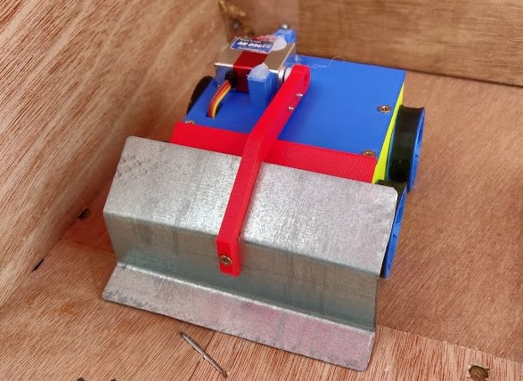

# Jimmy build guide

## Required components
Bear in mind that many of these parts may not be available or even produced anymore. Links are provided only for reference - just find something with similar characteristics and you'll be fine.
* 2 - 4x [Turnigy 15mm 75:1 motor](https://hobbyking.com/fr_fr/brushed-motor-15mm-6v-20000kv-w-75-1-ratio-gearbox.html)
* 2x [Brushed ESC](https://www.aliexpress.com/item/32888425852.html?spm=a2g0s.9042311.0.0.16024c4dQrNdOv)
* [HKS-9257 High Speed Servo](https://hobbyking.com/en_us/hks-9257-high-speed-servo-4-5kg-0-07sec-25g.html)
* 0.4mm aluminium sheet 
* [Turnigy NanoTech 2S LiPo](https://hobbyking.com/fr_fr/turnigy-nano-tech-370mah-2s-25-40c-lipo-pack.html)
* [Turnigy i6 receiver](https://hobbyking.com/fr_fr/turnigy-ia6-receiver-6ch-2-4g-afhds-2a-receiver.html)
* 2.5 x 16mm wood screws

## Required tools
These will be absolutely necessary:
* Soldering iron
* Precision screwdriver
* Jigsaw or anything else for cutting aluminium
* Vice (to bend aluminium sheet into a spoon)

And these are not, but will help:
* Hand file
* Hot glue gun
* Instant glue (any cyanoacrylate, eg. Superglue)

## Printing
You will find all of the required STLs in the stl folder. 
If you want to modify the design, feel free to fork the 
[OnShape project](https://cad.onshape.com/documents/349b4f8ed498f0b90818b4ce/w/3e599fa8d453d60d98da448e/e/12b1f6c43f724f686f509885).

### Chassis
All parts can be printed either with PLA, ABS or PETG. Original Jimmy was
printed with PLA. __Chassis__ and its cover should be printed with layer height
<= 0.35 mm.

### Wheels
For best traction, you will need to attach some additional rubber using instant
glue. In that case, you can print wheels using any filament available. In case
you do not want to glue any rubber, printing wheels in TPU will help with
traction. In that case, use the alternative design dedicated for TPU printing.

In any case, best print at layer height 0.2 mm.

## Electronics
There is nothing out of ordinary here, only generic stuff. I'll add a link to 
some RC model electronics tutorial

## Assembly
Work in progress, but to be fair there's nothing complex here, just print everything and cram it together.

## Finished build

